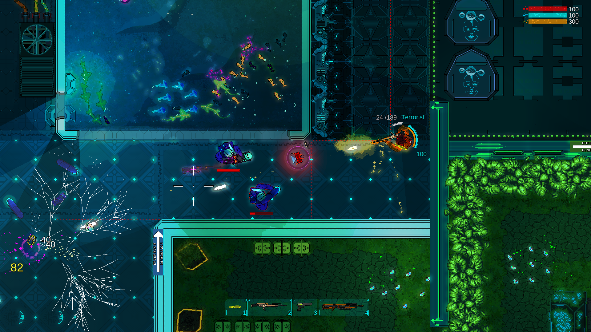
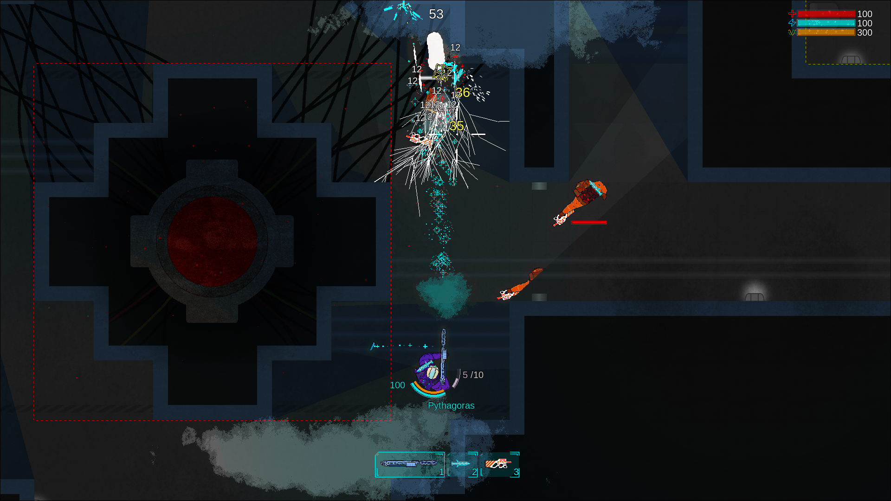
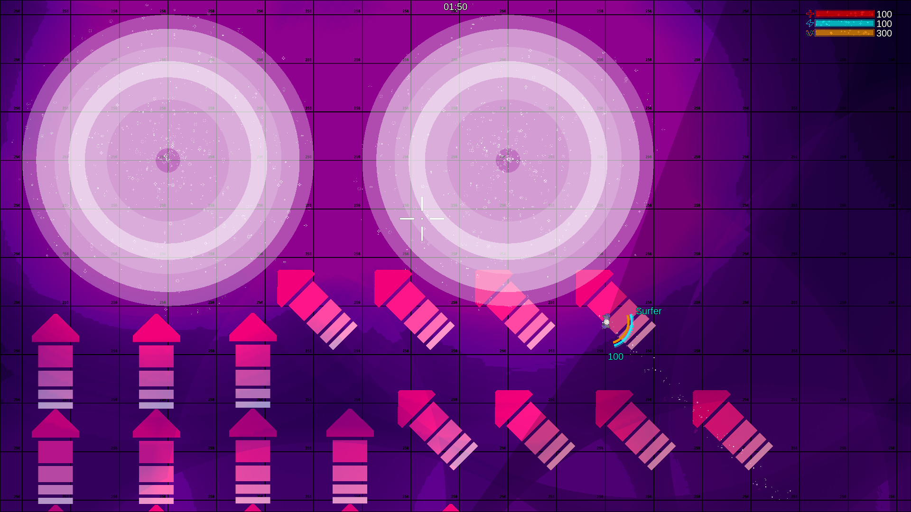
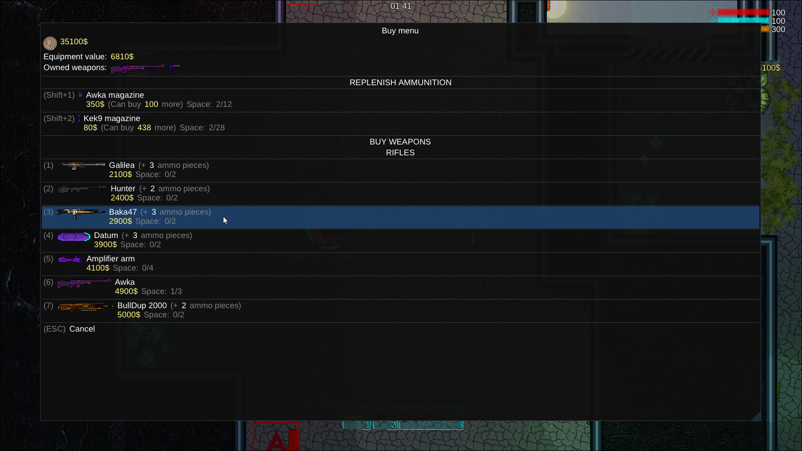
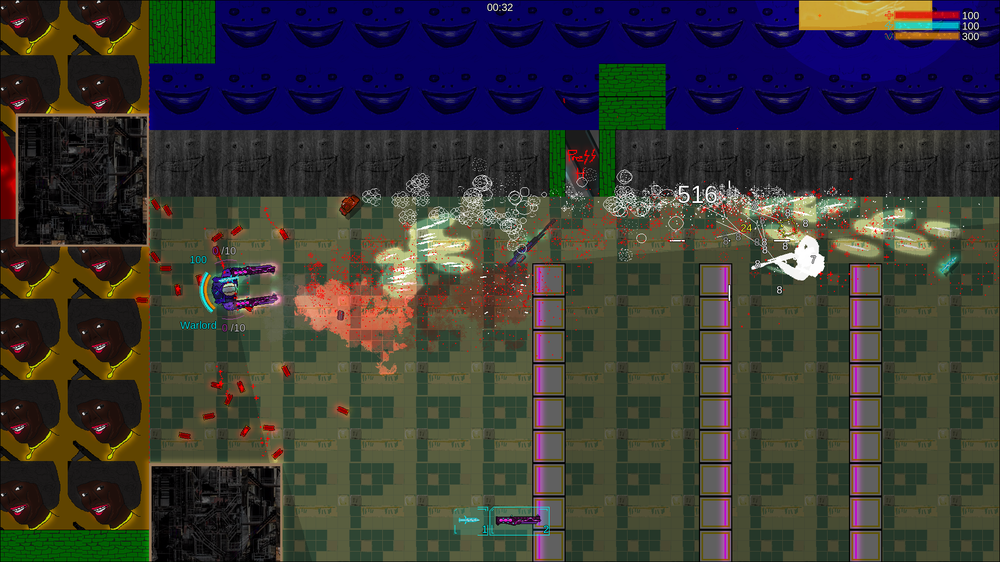
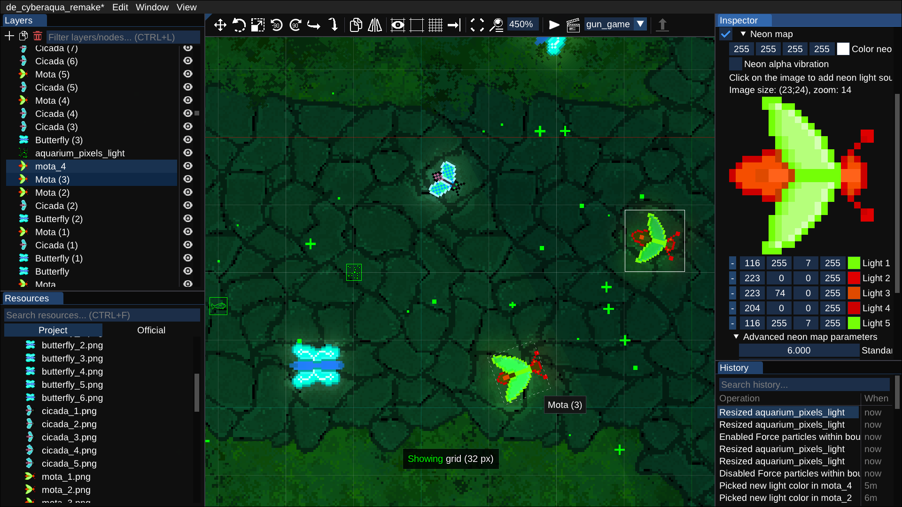
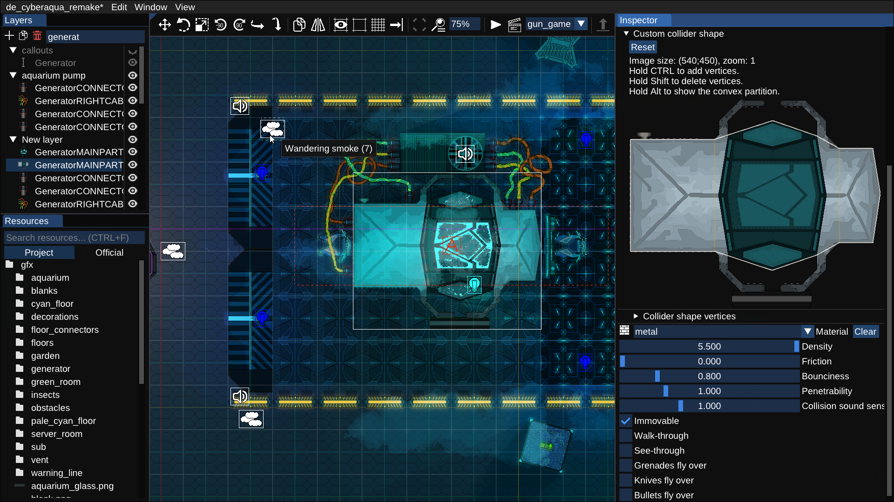

# Resources for journalists.

*Poland-based free & open-source shooter [whose code](https://github.com/TeamHypersomnia/rectpack2D) was used in [Assassin's Creed](https://www.youtube.com/watch?v=2KnjDL4DnwM&t=2382s) and [Skydio drones](https://pages.skydio.com/rs/784-TUF-591/images/Open%20Source%20Software%20Notice%20v0.2.html). Written without game engines, in C++, just 50 MB in size, 10 years in development, only one programmer and two designers. Featured in [Linux Magazine](https://pubhtml5.com/mxdt/dbwn/Linux_USA_10.2023_downmagaz.net/89) and [HackerNews](https://news.ycombinator.com/item?id=36469297).* 

[**Coming to Steam on Dec 28 2023.**](https://store.steampowered.com/app/2660970/Hypersomnia)

- [Socials](#socilal)
- [Videos](#features)
- [Game Screenshots](#game-screenshots)
- [Editor Screenshots](#editor-screenshots)
- [In Media](#in-media)
- [Factsheet](#factsheet)
- [Logos](#features)
- [Dev Team](#dev-team)

# Socials

- **Discord:** https://discord.com/invite/YC49E4G
- **Source code:** https://github.com/TeamHypersomnia/Hypersomnia
- **Homepage:** https://hypersomnia.xyz
- **Twitter:** https://twitter.com/teamhypersomnia
- **Contact:** patryk.czachurski@gmail.com

***Note: Discord is the #1 social.*** *It is the home of our community where both players and devs meet.*

# Videos

# Game Screenshots

<!--

-->

# Editor screenshots

# In Media

<!--

-->

- **[Linux Magazine](https://pubhtml5.com/mxdt/dbwn/Linux_USA_10.2023_downmagaz.net/89)**: *The whole package is a zany quick blast of adrenaline.*
- **[HackerNews](https://news.ycombinator.com/item?id=36469297)**: *Show HN: Open-source shooter which made it to AC: Valhalla and Skydio drones.*
- [ifun.de](https://www.ifun.de/hypersomnia-freier-multiplayer-shooter-fuer-mac-win-und-linux-212657/): *Hypersomnia: Freier Multiplayer-Shooter für Mac, Win und Linux*.
- [GAMINGDEPUTY](https://www.gamingdeputy.com/hypersomnia-is-a-free-multiplayer-shooter-for-mac-win-and-linux/): *Hypersomnia is a free multiplayer shooter for Mac, Win and Linux*.
- **[Open Source Friend](https://t.me/open_source_friend/2483)** (200 votes, 18k views)
- **[C++ Learning](https://t.me/Learning_pluses/1815)** (11k subscribers channel)

# Factsheet

- ***Hypersomnia*** is a free and open-source multiplayer shooter for Windows, Linux and MacOS.
- **[rectpack2D,](https://github.com/TeamHypersomnia/rectpack2D)** part of the game, was used in **[Assassin's Creed: Valhalla.](https://www.youtube.com/watch?v=2KnjDL4DnwM&t=2382s)**, **[Skydio drones](https://pages.skydio.com/rs/784-TUF-591/images/Open%20Source%20Software%20Notice%20v0.2.html)**, and [2 scientific papers.](https://scholar.google.com/scholar?hl=en&as_sdt=0%2C5&q=teamhypersomnia&btnG=)
- *Hypersomnia* is permanently free without hidden payments.
- *Hypersomnia* was inspired by Hotline Miami and Counter-Strike.

# Logos

# Dev Team

TeamHypersomnia is based in Poland.

- **[Patryk B. Czachurski (*Pythagoras*)](https://github.com/geneotech/)**
    - *Lead developer, programming & art director*
- Zbigniew *Spicmir* Vershstrup
    - *Graphics design & animations*
- [Michał *Billan* Kawczyński](https://www.facebook.com/profile.php?id=100001200683900)
    - *Level design*
- [Ernest *Hajt* Paśnik](https://github.com/ernestpasnik)
    - *Web backend developer* (https://hypersomnia.xyz)
