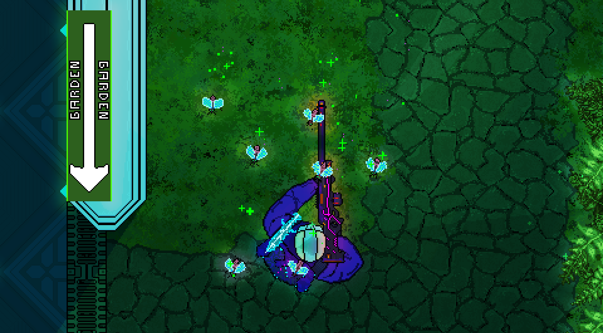

# Resources for journalists.

🇵🇱 *Poland-based free & open-source multiplayer shooter* :
- written without game engine, only in **C++**,
- which only size **50MB**,
- took **10 years** in development,
	+ with only one developer and 2 designers
- [whose code](https://github.com/TeamHypersomnia/Hypersomnia) was used in **[Assassin's Creed and Skydio drones.](https://github.com/TeamHypersomnia/rectpack2D#rectpack2d)**

Available on **[Windows, Linux & Mac](https://github.com/TeamHypersomnia/Hypersomnia?tab=readme-ov-file#downloads)** with **[Steam](https://store.steampowered.com/app/2660970/Hypersomnia)** and **[even in the browser!](https://hypersomnia.io)**

> Played on the [39th PolyLAN tournament in Switzerland](https://store.steampowered.com/news/app/2660970/view/4186736071064310840).

*Featured in [Linux Magazine](https://www.scribd.com/document/763273177/Linux-Magazine-October-2023-USA) page 89, [Liam @ GamingOnLinux](https://mastodon.social/@gamingonlinux/112609228144158828) and even on [GitHub Blog.](https://github.blog/open-source/gaming/game-bytes-january-2024/#hypersomnia-release-on-steam)*

**[Official YouTube Trailer](https://www.youtube.com/watch?v=L4zSA34fD_E)**

*Download all logos & screenshots **[as a ZIP file.](https://github.com/TeamHypersomnia/PressKit/archive/refs/heads/main.zip)***

## Contents

- [Logos](#logos)
- [Factsheet](#factsheet)
- [Descriptions](#descriptions)
  - [Short teaser v1](#short-teaser-v1)
  - [Short teaser v2](#short-teaser-v2)
  - [Long teaser v1](#long-teaser-v1)
  - [Long teaser v2](#long-teaser-v2)
- [Links](#links)
- [In Media](#in-media)
- [Videos](#videos)
- [Game Screenshots](#game-screenshots)
- [Social media tags](#social-media-tags)
    - [For gamers](#for-gamers)
    - [For programmers](#for-programmers)
- [Author Bio](#author-bio)
- [Credits](https://github.com/TeamHypersomnia/PressKit/blob/main/CREDITS.md#intro)

## Logos

> The logos and others pictures of Hypersomnia can be seen [here, in github](https://github.com/TeamHypersomnia/PressKit/tree/main/assets/logos) or [downloaded in this zip file](https://github.com/TeamHypersomnia/PressKit/archive/refs/heads/main.zip).

## Factsheet

- ***Hypersomnia*** is a free and open-source multiplayer top-down shooter for Windows, Linux and MacOS, **and the Web.**
- **[rectpack2D](https://github.com/TeamHypersomnia/rectpack2D)**, a part of the game code, was used in **[Assassin's Creed: Valhalla.](https://www.youtube.com/watch?v=2KnjDL4DnwM&t=2382s)**, **[Skydio drones](https://pages.skydio.com/rs/784-TUF-591/images/Open%20Source%20Software%20Notice%20v0.2.html)**, and [2 scientific papers.](https://scholar.google.com/scholar?hl=en&as_sdt=0%2C5&q=teamhypersomnia&btnG=)
- *Hypersomnia* successfully employs **cross-platform simulation determinism** which is arguably the hardest **game networking strategy**.
    - For a deep dive through technical details, [visit this README](https://github.com/TeamHypersomnia/Hypersomnia#tech-highlights).
- First GitHub commit is from **2013**.
- The game became playable in **2017**.
- Permanently **free, without hidden payments**.
- Heavily inspired by ***Hotline Miami*** and ***Counter-Strike***.
- Borne out of a **childhood dream** to have an **own online game universe** full of people.
- Current goal is to become a professional **eSports game**, and to be fully **extensible by community mods**.
- Comes with an in-game WYSIWYG editor that lets you host a **work-in-progress map** to test with your friends in a single click. Quickly iterate your map unlike in any game engine.
- Licensed under **AGPL-3.0** - this means **everyone can modify Hypersomnia to their heart's content**, and even publish these altered versions under their name as long as they keep the complete source code public.

## Descriptions

**Feel free to copy and reword these however you wish.**

> [!Note]
> These are taken directly from GitHub and Steam pages.

### Short teaser v1

*Challenge your friend to an intense duel, or gather two clans to fight a spectacular war. Reawaken your competitive spirit in this relentless top-down shooter. Comes with an in-game map Editor! Forever free and open-source.*

### Short teaser v2

*Online shooter with relentless dynamics.*
*Challenge your friend to an intense duel, or gather two clans to fight a spectacular war.*

*Written in modern C++, without a game engine*
*Forever free and open-source :heart:*

### Long teaser v1

*Hypersomnia* is a free and open-source competitive shooter.

The game has been online and playable since 2017. It brings together:

- the tactics of *Counter-Strike*,
- the dynamics of *Hotline Miami*,
- the pixel art nostalgia of oldschool RPGs
- and the potential for endless creativity thanks to an in-game map editor!

*Hypersomnia* aims to be **the ultimate open-source 2D shooter** - a grand community project extensible without limit.

### Long teaser v2

*Hypersomnia* is a hardcore shooter mixing eSports with pixel nostalgia.
Every match will be unforgiving - every duel a psychological battle.

More of a peaceful soul?
Unleash your creativity in the **WYSIWYG in-game map Editor** with instant playtesting.

It's all free and open-source.
Written without a game engine, in bare C++. Only 50 MB.
Feel free to build it yourself from GitHub and modify *Hypersomnia* to your heart's content.

Features:

- 24 unique firearms.
- 4 grenade types, 7 melee weapons and 6 magic spells.
- 2 game modes: Bomb defusal (team-based) and Gun game (free-for all).
- An in-game map editor that lets you host a work-in-progress map to test with your friends in a single click. Quickly iterate your map unlike in any game engine.

## Links

### Community

- **Discord:** https://discord.com/invite/YC49E4G
- **Mastodon:** https://pol.social/@hypersomnia
- **Contact:** <a href="mailto:patryk.czachurski@gmail.com"> patryk.czachurski@gmail.com </a>

### Medias

- **Twitter:** https://twitter.com/teamhypersomnia
- **Twitch:** https://www.twitch.tv/directory/category/hypersomnia
- **YouTube:** https://www.youtube.com/@teamhypersomnia
- **Telegram:** https://t.me/hypersomnia_io

### Project

- **Homepage:** https://hypersomnia.xyz
- **Source code:** https://github.com/TeamHypersomnia/Hypersomnia

### Game

- **itch.io:** https://hyperdev.itch.io/hypersomnia
- **Browser version:** https://hypersomnia.io
- **Steam:** https://store.steampowered.com/app/2660970/Hypersomnia/
- **Telegram (server monitor):** https://t.me/hypersomnia_monitor

To reach me on Matrix, you can hop onto the [onFOSS chat](https://onfoss.org/) (I'm friends with them) and ping `@pythagoras`:
https://matrix.to/#/#irc_#onfoss:matrix.f-hub.org

> [!Note]
> **Note: Discord is the #1 social.** It is the home of our community where devs and players meet.

## In Media

***(You could be here! Let me know about your publications at patryk.czachurski@gmail.com)***

<!--

-->

- [**Liam @ GamingOnLinux**](https://mastodon.social/@gamingonlinux/112609228144158828): Sounds like some impressive tech going on behind the scenes.
- [**GitHub Blog**](https://steamcommunity.com/linkfilter/?u=https%3A%2F%2Fgithub.blog%2F2024-01-18-game-bytes-january-2024%2F%23hypersomnia-release-on-steam): Not just fun, it’s technically innovative.
- [**Linux Magazine**](https://fr.scribd.com/document/763273177/Linux-Magazine-October-2023-USA#page=89): The whole package is a zany quick blast of adrenaline.
- [**HackerNews**](https://news.ycombinator.com/item?id=36469297): Show HN: Open-source shooter which made it to AC: Valhalla and Skydio drones.
- [**Open Source Friend**](https://t.me/open_source_friend/2483) Hypersomnia - это онлайн-шутер, написанный на современном C++.
- [**zgrywuski.pl**](https://zgrywuski.pl/hypersomnia-ma-wczesny-dostep-bez-wymagan-bez-silnika-bez-litosci/): Bez wymagań, bez silnika, bez litości.
- [**linuxgameconsortium.com**](https://linuxgameconsortium.com/hypersomnia-a-tough-shooter-you-can-shape/): Hypersomnia: a tough shooter you can shape.
- [**ifun.de**](https://www.ifun.de/hypersomnia-freier-multiplayer-shooter-fuer-mac-win-und-linux-212657/): Hypersomnia: Freier Multiplayer-Shooter für Mac, Win und Linux.
- [**gamingdeputy.com**](https://www.gamingdeputy.com/hypersomnia-is-a-free-multiplayer-shooter-for-mac-win-and-linux/): Hypersomnia is a free multiplayer shooter for Mac, Win and Linux.

### Videos

|Trailer|Gameplay|Tutorial|Dev_Journal
|---|---|---|---|
|||

## Social media tags

### For gamers

*(comma-separated)*

``hypersomnia, hypersomnia shooter, teamhypersomnia, open source shooter, free shooter, free 2d shooter, 2d topdown, 2d topdown shooter, topdown shooter, top-down shooter, pixelart, pixel art, pixel-art shooter, indie shooter, 2d shooter, online shooter, competitive shooter, competitive 2d``

### For programmers

*(space-separated)*

``game cpp c-plus-plus gamedev multiplayer pixel-art game-development free-software shooter multiplayer-game 2d-game shooter-game pixelart top-down-shooter 2d-shooter pixelart-game top-down-game indie-game top-down-shooter-game topdown-shooter``

## Game Screenshots

<table>
  <tr>
    <th></th>
    <th></th>
  </tr>
  <tr>
    <td>
    <td>
  </tr>
  <tr>
    <td>
    <td>
  </tr>
</table>

## Author Bio

- **When I was 13**, my only wish was to have my own MMORPG.
- This is when I picked up my first programming book, [Symfonia C++](https://www.ifj.edu.pl/private/grebosz/symfonia_c++_std_p.html) by Jerzy Grębosz.
- I'm completely self-taught, though I did enroll at the [top3 high school in the country (at the time)](https://www.v-lo.krakow.pl/).
- I began writing *Hypersomnia* once I turned 18. I'm now 29.
- At 19 I **went to work** as a junior C++ programmer instead of going for a higher education.
- I later went on multiple year-long breaks from work to focus on writing *Hypersomnia*, whilst living from my savings.
- Since 2020, I have become passionate about investing, thanks to which my savings lasted way longer than they'd otherwise.
- My financial decisions now let me focus 100% on *Hypersomnia*.
- I use Arch Linux (btw), and I wrote *Hypersomnia* in NeoVim
  - *without* autocomplete (but with 21 other plugins - [vim-easymotion](https://github.com/easymotion/vim-easymotion) being my favorite).

## Credits

[**See here**](https://github.com/TeamHypersomnia/PressKit/blob/main/CREDITS.md#intro)
